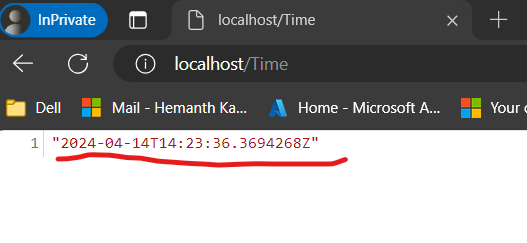

# Documentation for Part1

1. Created Docker file for the project
2. Build the Docker file and generted the image
3. Containerized the Docker file

As the per the task soluction has been triggered via `Deploy.ps1` script

# Outputs are attached in the form of images

# Created a DockerFile 

  

# PART 2 DOCUMENTATION

# Hosting provider

1. In this moderen world all the applications are being deployed to microservices and cloud based for High performance and avialility

Azure kubernetes Service is highly modular and can be deployed to any cloud

Its a fully cloud managed service and many advanced services and features are available

# web services deployment to CLuster

We can deploy our services to via Kube manifests files to pods in the form of Deployments and by using LoadBalancing service we can expose our applicatoin to the internet in more secure way.

Here we are placing the application behind the LoadBalancing service

# Notifications to Support Team

By configuring the monitoring tools Prometheus and Grafana, you can effectively oversee your cluster, its services, pods, and essential metrics such as CPU and memory usage. Through visually informative dashboards, you can effortlessly observe the health and performance of your system. Additionally, you can establish alert mechanisms to promptly notify the support team via email or ticket whenever a service experiences downtime

# Automated Code deployments for developers

This can be achieved by using CI/CD pipelines to deploy your application and integrate your application into the AKS clusters via Kubemanifest files.

If we ar using multiple cluster dpeloyment its good to go with Helm chart for kubemnifest file deployments which makes the deployments simple and faster

# Access pre-existing internal systems on the "internal-assets" virtual network

1. Virtual Network Peering: Set up virtual network peering between the virtual network where your Kubernetes cluster resides and the "internal-assets" virtual network. This establishes a private connection between the two networks, allowing secure communication without exposing internal assets to the public internet

2. Writing NSG Rules we can controll and inbound and outbound traffic

3. Access Control: Implement access control mechanisms such as role-based access control (RBAC) and Azure Active Directory (Azure AD) integration to enforce least privilege access to resources within the virtual network. This ensures that only authorized users and applications can access the internal systems.

